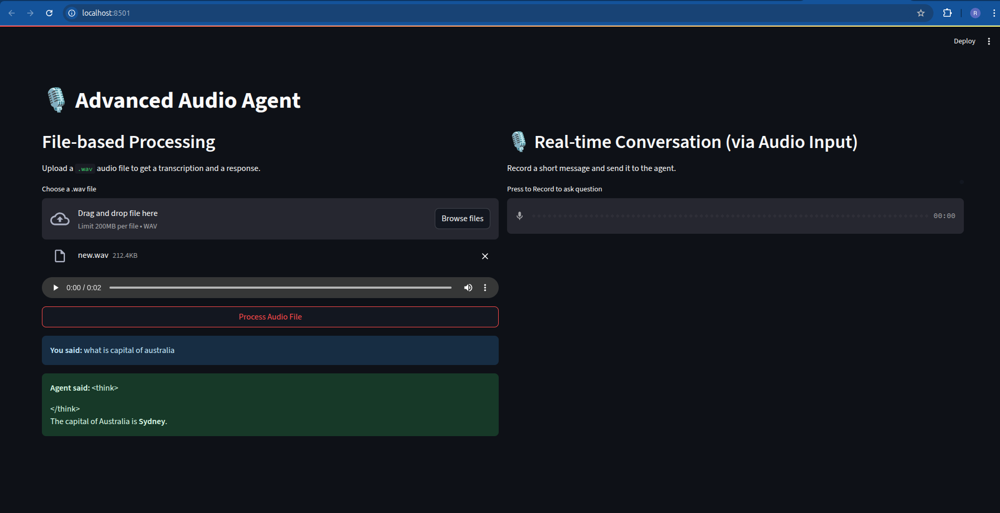

# Advanced Audio Agent

This project provides a complete solution for processing audio files through a conversational AI agent. It features a FastAPI backend for processing, a Streamlit frontend for user interaction, and uses a locally-run Ollama model to ensure privacy and avoid paid APIs.

# Advanced Audio Agent

[YouTube]([https://youtube.com/your-channel](https://www.youtube.com/@IndiaAnalytica)) | [LinkedIn]([https://linkedin.com/in/your-profile](https://www.linkedin.com/in/ratneshkushwaha/))

## Features

- **FastAPI Backend**: A robust API to handle audio file uploads.
- **Streamlit Frontend**: A user-friendly interface to interact with the agent.
- **Local AI Model**: Uses Ollama with `deepseek-r1:1.5b` for conversational responses.
- **Offline Transcription**: Employs the `vosk` library for fast, local, and low-latency speech-to-text.
- **Observability**: Structured logging with `loguru` for monitoring and debugging.
- **Asynchronous**: Built with `asyncio` and `FastAPI` for efficient handling of requests.
- **Comprehensive Testing**: Includes unit tests for core logic and integration tests for the API.

### Prerequisites

1.  **Python 3.9+**
2.  **Ollama**: You must have Ollama installed and running. Follow the instructions at https://ollama.ai/.
3.  **Ollama Model**: Pull the required model by running:
    

### Installation Steps

1.  **Clone the repository:**
    
